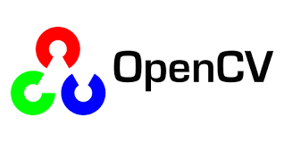

# Hi there 👋🏻

My name is **Pichai Jiamwiwat,** but you can call me **Pat.** I recently graduated with a degree in Data Science and Analytics. I'm also a self-taught developer, passionate about prompt engineering, research, data, and AI.

> "When it doesn’t exist, build it. That’s what a developer does."

**My Blog shareing**

- [prompt engineering technique](https://medium.com/@pijiamtech/prompt-engineering-technique-d1e71a3da5d5)

**SKILLS**

- Programming Languages

- Library/Framework

- Database

- Tools

**My Projects**

- **Web scraping** using `Python` `BeautifulSoup` `Requests`

  - Designed and structured JSON schema for each webpage.
  - Captured and organized all content linked across the target website.
  - Converted data into Markdown and other formats, preparing it for use in Retrieval-Augmented Generation (RAG) applications.

- **Retrieval-Augmented Generation DEMO** using `Python`  `Transformers` `BGEM3FlagModel` `Qdrant`

   - Gained hands-on understanding of the Retrieval-Augmented Generation (RAG) workflow.
   - Integrated with Large Language Models (LLMs).
   - Utilized Qdrant for data storage and vector search.

- **Binary Classification with a Bank Dataset** using `Python` `Scikit-Learn` `CatBoostClassifier`

  - Built a binary classifier to predict customer behavior using Scikit-Learn and CatBoost.
  - Performed data preprocessing, feature engineering, and model evaluation.
  - Achieved 97% accuracy and visualized feature importance.

- **LLM-Controlled Smart Home Simulator** using `Python` `mcp_tools` `ollama` `Firebase`

  - Updated device states via Firebase Realtime Database to simulate a responsive smart home.
  - Integrated mcp_tools for seamless tool invocation and task execution.
  - Visualized system outputs through a dashboard interface.

**Currently Focus**

- Learning advanced Python techniques, best practices, and state-of-the-art AI.
- Exploring opportunities for collaboration and real-world projects.

## 📫 How to reach me :

[**📄 View My Resume**](https://drive.google.com/file/d/1Wn20VStlHEhjcRkNj7hrZ6j4NMGQsUuK/view?usp=sharing)

---

